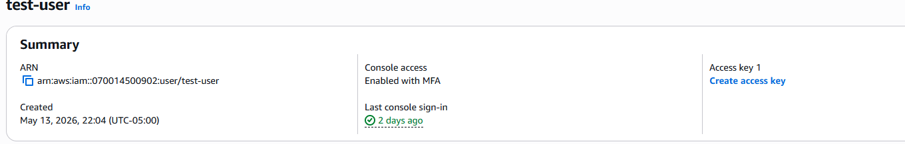
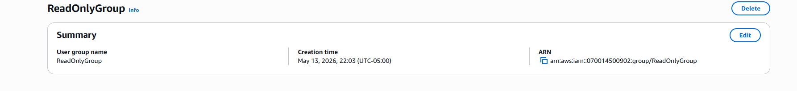
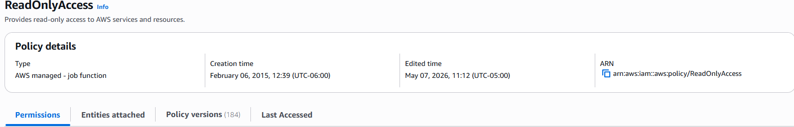
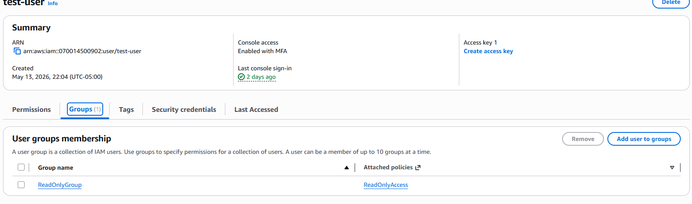
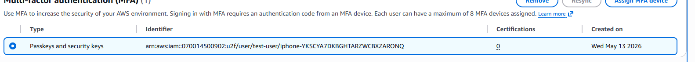
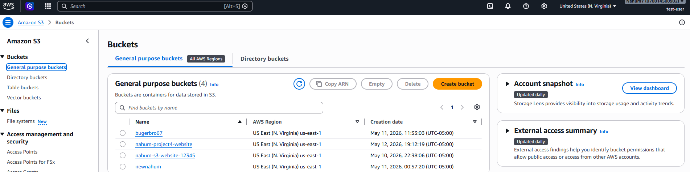
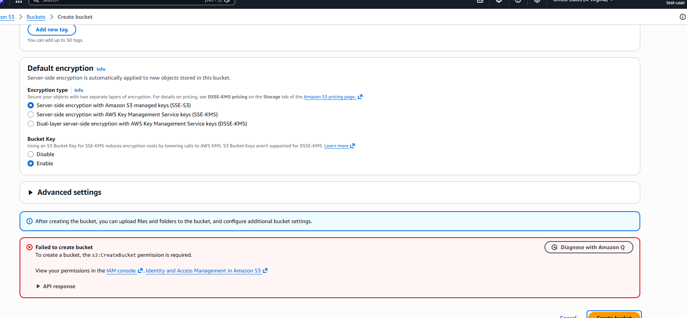

# AWS IAM User Permissions Project

This project demonstrates how to create and manage IAM users, groups, and permissions in AWS using the principle of least privilege.

## What I Built
- Created a new IAM user
- Created an IAM group with least‑privilege permissions
- Attached the AWS managed policy ReadOnlyAccess
- Added the user to the group
- Enabled MFA for the IAM user
- Logged in as the IAM user to test allowed and denied actions
- Verified that permissions worked correctly

## Screenshots

### IAM User Created

### IAM Group Created

### Policy Attached to Group

### User Added to Group

### MFA Enabled

### Access Allowed (ReadOnly)

### Access Denied (No Write Permissions)

